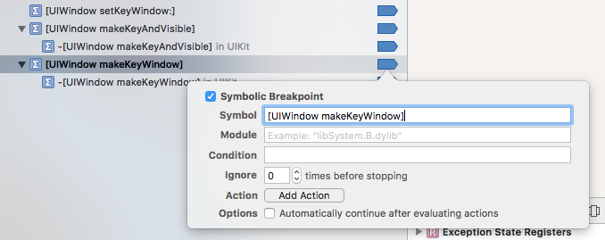
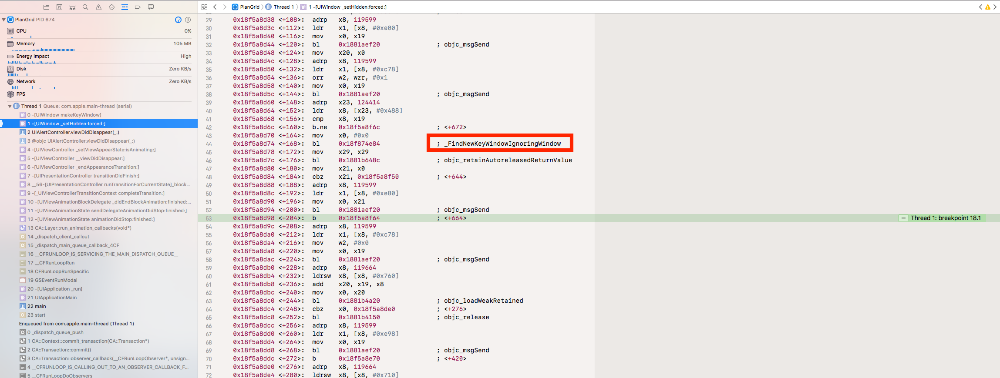
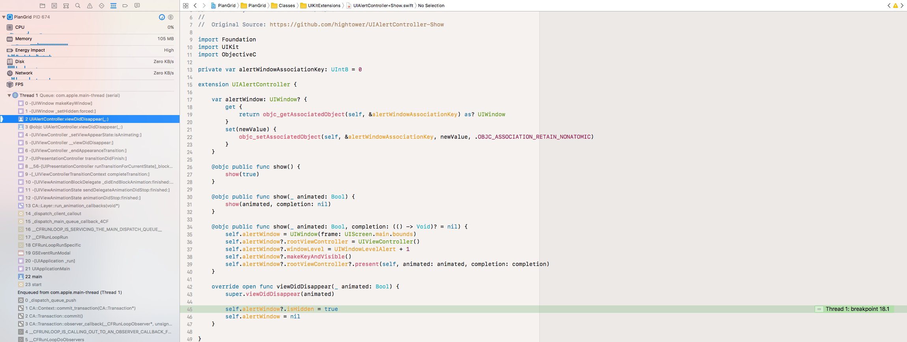

+++
date = "2017-06-16T22:24:54-08:00"
draft = false
title = "Another Small UIKit Debugging Adventure"
slug = "another-small-uikit-debugging-adventure"
disqus_url = "http://blog.benjamin-encz.de/post/another-small-uikit-debugging-adventure/"
+++

Working with closed source APIs sometimes requires us to use advanced debugging techniques to track down issues that cannot be explained by our application code alone. 

This week I had an interesting debugging session in which I learned more about the behavior of apps with multiple `UIWindows`. These kind of posts are mostly useful for me as an attempt to retain some knowledge. But I hope this story is entertaining and useful to you too!

<!--more-->

----

## The Mystery

At PlanGrid we recently integrated the [Mapbox Fingertips](https://github.com/mapbox/Fingertips) library to build a presentation mode for our app. The library allows enabling a mode in which all user touches are visualized on the screen.

**When testing the changed we noticed that, under certain circumstances, our app would no longer present `UIMenuController` instances.** This happened despite the debugger showing that the following line was running:

```
[_menu setMenuVisible:YES animated:YES];
```

We found a way to reproduce the issue, but it still wasn't clear why `UIMenuController`s would not show up in certain situations.

I found a few hints around the internet. There are a surprising amount of prerequisites for menu controllers to work correctly. From [StackOverflow](https://stackoverflow.com/a/23839272/1046430):

> 1. The menu handler must be a UIView. If it isn't, `-becomeFirstResponder` fails.
> 2. The menu handler must have `userInteractionEnabled = YES`
> 3. The menu handler must be in the view hierarchy and its `-window` property must be the same as the window for the view in the `inView:` argument.
> 4. You need to implement `-canBecomeFirstResponder` and return `YES`.
> 5. You need to call `[handler becomeFirstResponder]`, before `[menu setTargetRect:inView:]` is called, or the latter will fail.
> 6. You need to call `[menu setTargetRect:inView]` (at least once) and `[menu setMenuVisible:animated:]`.

However, all of these requirements were fulfilled! 

## An Insight

After some regular inspection of variables, etc. I decided to open the view hierarchy debugger. There I noticed something interesting. When in presentation mode our app would have two `UIWindow` instances. The `MBFingerTipWindow`, the main application window, and the `MBFingerTipOverlayWindow`, a second window that is used to visualize a user's touches. I also noticed that in the case in which `UIMenuController`s would no longer show up, the `MBFingerTipOverlayWindow` would be the `keyWindow` of the application. This was unexpected as typically the main application window remains the `keyWindow` throughout the entire time an app is open.

By googling for `UIMenuController` and `keyWindow` I could find this [very helpful blog post](http://supereasyapps.com/blog/2014/4/17/show-the-uimenucontroller-and-display-custom-edit-menus-for-uiviewcontroller-uitableviewcontroller-and-uicollectionview-on-ios-7):

>  The UIMenuController can only be displayed on the key window. There are times where you might use someone else's library or framework to display a full-screen advertisement or maybe a mobile printing solution like Sincerely Ship. In these cases I have run into issues where the third-party code has changed key windows, by adding their own UIWindow and didn't reset the key window.

This means there are 7 (not 6) prerequisites for successfully presenting a `UIMenuViewController`!

## Leveraging Symbolic Breakpoints & The Disassembler

At this point I knew that for some reason the `MBFingerTipOverlayWindow` was becoming the `keyWindow`, which prevented the `UIMenuController` from being presented. However, I still did not know why that was happening. Symbolic breakpoints to the rescue!



With this breakpoint in place I was able to see whenever the `keyWindow` changed. I went through our reproduction case and trapped in the symbolic breakpoint:



Stepping up through the stack I could find the place in our application code that triggered the window change:



The code in the screenshot is from a [shim](https://github.com/hightower/UIAlertController-Show) that we added to the codebase when migrating to iOS 10. It allowed us to retain the deprecated `UIAlertView` API for places in which switching to `UIAlertViewController` would have been a fair amount of work (we have a lot of alerts, but after this issue we decided to remove the shim for good).

The shim allows presenting a `UIAlertViewController` by simply calling a `show` method. That `show` method creates a new `UIWindow` that is presented on top of the main application window. When the alert view gets hidden, the newly created `UIWindow` is made invisible. As you can see in the stacktrace, this is what triggers the `keyWindow` to change!

The first stacktrace screenshot shows that an internal UIKit function called `_FindNewKeyWindowIgnoringWindow` is called immediately before the `keyWindow` is changed.

Using the Hopper Disassembler we can take a peek at the implementation of that function:


By looking at the pseudo code it becomes obvious that UIKit picks the **topmost window as the new `keyWindow` as soon as the current `keyWindow` becomes invisible**. This meant that the presentation of `UIMenuController`s would stop working after the alert shim was used, because the overlay window would mistakenly become the `keyWindow`. 

At this point the fix became straightforward; we needed to remember the previous key window when presenting the alert and reset the key window correctly upon dismissal:


override open func viewDidDisappear(_ animated: Bool) {
        super.viewDidDisappear(animated)

        self.alertWindow?.isHidden = true
        self.alertWindow = nil

        // After hiding the alert, make the previous 
        // key window the current key window again.
        // By default UIKit picks the top most window,
        // which might or might not be the correct
        // key window. In our case we show a tap visualization 
        // overlay window (`MBFingerTipOverlayWindow`) on top 
        // of the main window and we want to avoid that overaly
        // Window to become the key window. Among other reasons,
        // setting the correct key window is
        // important as `UIMenuController`s can only be
        // presented in the key window.
        self.previousKeyWindow?.makeKey()
        self.previousKeyWindow = nil
    }


## Conclusion

When working with closed source APIs, advanced debugging and some basic reverse engineers skills can be handy once in a while - so I try to practice when I can. 

Also, the `UIMenuController` API is not very developer friendly!