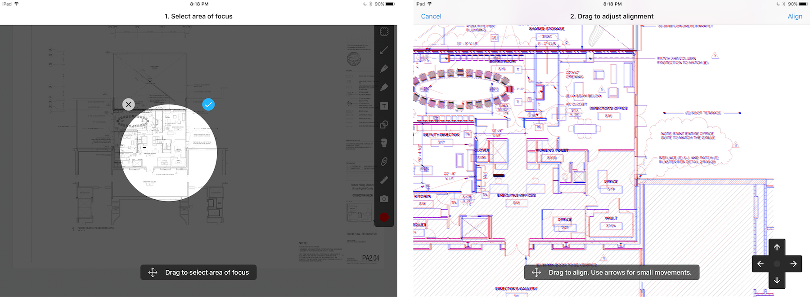

+++
date = "2017-07-31T22:24:54-08:00"
draft = false
title = "Quick Thoughts on Prototyping Software"
slug = "quick-thoughts-prototyping-software"
disqus_url = "http://blog.benjamin-encz.de/post/quick-thoughts-prototyping-software/"
+++

It's almost the end of July and I've tried to keep up a schedule of blogging at least once a month. So I decided to pull a topic from the long pile of potential blog posts I've accumulated: **prototyping**. 

This posts focuses on using prototypes to validate technical ideas, not on creating prototypes for user testing.

<!--more-->

----

I've spent a lot of time in the last years improving my software prototyping skills. In this post I hope to share some quick thoughts on why I think prototyping is important and how I approach it.

### Prototypes as Proofs

My main goal when prototyping is to prove or disprove the feasibility of a proposed software product. These proofs can come in different flavors.

#### Proving Effort for a new Feature

This type of proof is always relative to the amount of effort I think is acceptable for a given feature. With prototyping I try to prove that I can build a new feature within a given, typically fairly short, timeframe.

Both in a personal and professional context these prototypes help me decide whether or not I will pursue a feature or product.

#### Proving Complex Technical Projects

Prototypes are also ideal to validate complex technical designs for large projects. Often these projects come with elaborate specs; but in my experience these specs are not worth much if the outlined ideas haven't been proven in a usable prototype. This is especially true for software that will interface with other systems (e.g. APIs).

#### Trying out New Technologies

Every once in a while I use prototypes to evaluate new tools and technologies that have the potential to significantly improve the products I work on or the tools I work with. Typically investing just a few hours will let me evaluate whether or not a new technology is worth incorporating into a product. Mostly the answer will be *No* but the large potential gains from a technology that *can* be applied make it worth investing in this category.

### The Process: Spec ➡️ Milestones ➡️ Prototype

Independent of the scale of the prototype, I always start with a spec. This spec outlines the goal of the prototype. For small projects it can be extremely brief. 

Here's an example of a brief spec of a prototype that I built for PlanGrid. The prototype allows users to align blueprints that they want to overlay and compare:

> Implement a sheet alignment feature that allows users to align two compared sheets relative to each other. 
>
> The feature allows selecting an area that should be used to align two sheets. In the next step the user can drag the sheets relative to each other in order to align them. 
>
> When the user is done, we store the determined offset such that the alignment can be applied when the sheets are compared in future.

Here are screenshots of two of the steps from the final implementation (not the prototype):

Once I've defined the spec for a prototype, I go on to outline the relevant milestones. 

For most prototypes this is the most important step. **When defining milestones I try to identify the tasks that are the riskiest or which I anticipate to take the longest.** Once I've implemented these critical milestones, I've basically proven the feasibility of the prototype, so I try to move these milestones up as far as possible.

For the sheet alignment feature shown above I knew that the prototype needed the following milestones:

1. Provide a UI that allows users to select a focus area for sheet alignment.
2. Capture the selected area from both rendered sheets in order overlay them.
3. Provide a UI for aligning the selected areas from both sheets; this UI allows users to drag a sheet relative to another one and to save the offset once they complete that step.

I noticed that the third milestone was the core of this feature, so I decided to tackle that milestone first.

I ended up starting my prototype by creating a separate app that was able to render two stock images on top of each other, in different colors, and allowed a user to align these images and save the offset that they applied. This app encapsulated the entire step 3 listed above.

Here's a screenshot of the prototype:

Within a few hours that app was working and I was confident that I had proven that I could build the entire feature in a reasonably short time.

### Prototyping Beyond the Point of No Return

Over the years I've noticed that prototyping is not only a good tool for proving feasibility or estimating effort, but also an important way to handle my psychology around building new features. 

By focusing on the riskiest parts of the new product first and quickly proving that they are relatively easy to implement, I can overcome the inertia that often looms when facing large new tasks.

Once I've successfully implemented the riskiest portion I surpass what I consider the "point of no return" and reach a state of flow in which all other milestones of a feature become easy to implement.

### Conclusion

Prototypes are a fantastic tool for performing the most important task of software development: breaking down a large and complex task into a series of measurable, small deliverables that add up to the final product.

I think most teams could spend more time prototyping to validate technical specs and to test how much effort it takes to build new features. I'm certainly trying to push myself to build more prototypes in future.

Leveraging tools such as Swift Playgrounds or spinning up separate applications for the core of the prototype can further speed up the development process & enable flow.