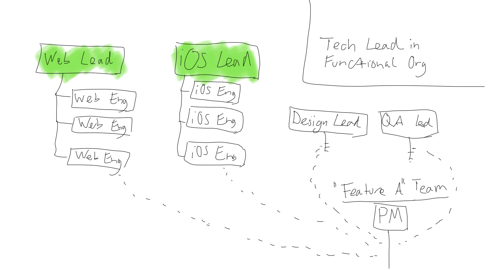
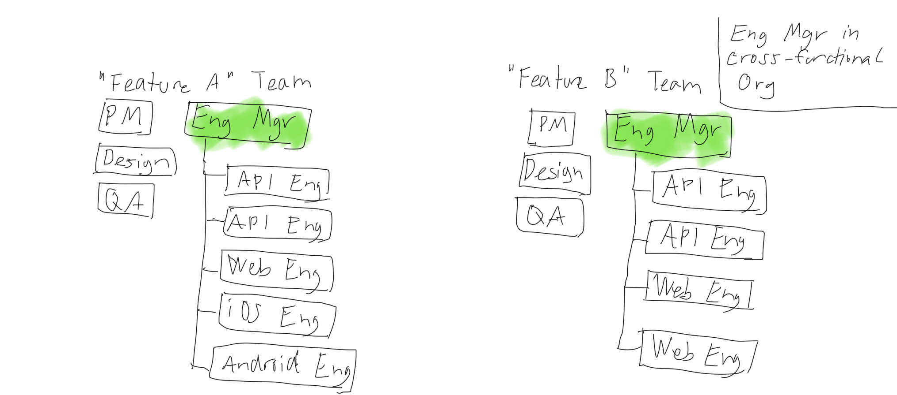
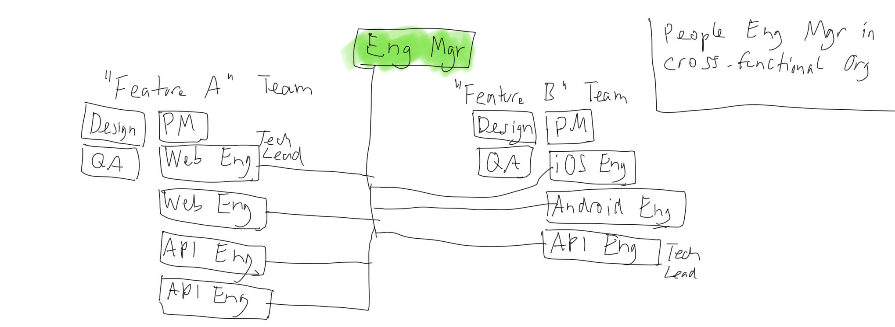

+++
date = "2018-02-19T13:00:00-08:00"
draft = false
title = "Flavors of Engineering Management"
slug = "flavors-of-engineering-management"
disqus_url = "http://blog.benjamin-encz.de/post/flavors-of-engineering-management/"
+++

What is like to be an engineering manager vs. an individual contributor? Should engineering managers code? What do engineering managers actually do? The correct, yet unhelpful answer is: "it depends".

The (software) engineering management role comes in many flavors. This means that the day-to-day work can be vastly different. If you're trying to learn from engineering manager peers or are considering getting into engineering management, these differences are important to understand.

<!--more-->

So far I've identified the following flavors:

- **Tech lead engineering manager** (typically technology stack focused team, still lots of coding, leadership via technical merits, good for recruiting)
- **Product team engineering manager** (team spans multiple technology stacks, can touch on product management and project management, needs to think more about cross-functional interactions)
- **People engineering manager** (very focused on people aspects, has strong individual contributors who drive a lot of decision making, hiring, etc., can support larger team)

Some engineering managers might fall into multiple of these buckets at the same time. Some of these flavors can exist on different levels of the organization (first-level manager, director, etc.), but these nuances are outside of the scope of this post. 

All flavors of engineering managers also have a lot in common: they are responsible for recruiting, helping their team advance their career, provide context to their team about what is going on in the larger organization, etc. However, the flavor has a big impact on what the engineering manager will focus on.

### The Tech Lead Engineering Manager

The tech lead engineering manager typically leads a small to mid-sized team of ~3-8 engineers who are working within the same technology stack. They have strong technical experience in their relevant field. They stay involved in many major technical decisions and often spend a significant amount of their time coding (up to ~50%).

They are typically embedded in a functional organization, where reporting structures are built around the areas of expertise and where feature teams are composed of folks from various organizational teams. This means they aren't directly responsible for any product area. Instead they ensure that various product features can be built efficiently on their platform.

In my experience this setup makes it easier for the engineering manager to hire. Most engineers enjoy reporting to someone who has deep expertise in their own area.

This type of engineering manager will often be directly involved in mentoring team members.

One of the biggest risks is micromanagement because the manager still works as a contributor on the team. Another risk lies in the combination of technical and people leadership in a single role. In most cases the tech lead engineering manager should try to turn someone on their team into a technical leader (without people responsibility), such that the team depends less on a single person.

When evaluating team members and creating career plans, the engineering manager can largely rely on their own technical expertise. However, they definitely should include feedback from peers on the team as well as from product managers, designers, etc. from the cross-functional feature team the engineer is working on.

In this setup someone besides the engineering manager is directly responsible for a certain product area. At many companies that's a product manager's responsibility. The engineering manager needs to be able to work closely with the product managers of the various product areas and provide them with adequate staffing for their projects.

### The Product Team Engineering Manager

The product team engineering manager typically leads a mid-sized team of ~4-8 engineers who are working in the same product area. These engineers work on different technology stacks. This engineering manager will typically spend little time coding, as they need to be broadly involved in many different technology stacks (Web, API, Mobile, etc.). They may instead spend more time working on technical architecture documents that outline changes across all of the platforms on their team. An important role of this engineering manager is to be the glue between engineers working on different technology stacks on their team.

They are typically embedded in a cross-functional organization. This means they are directly responsible for all engineering work in a given product area. 

As a result of this organization the engineering manager needs to interact more frequently with engineering managers from other cross-functional teams. Since engineers working on the same technology stack are spread across different teams, the engineering managers play an important role in keeping these engineers in sync and sharing knowledge and code as much as possible.

In this setup the engineering manager needs to be closely aligned with their cross-functional peers (product, design, QA, etc.). The engineering manager needs a strong understanding of the product area to help guide the future roadmap from a technical perspective.

In my experience hiring can be more challenging in this model, compared to the tech lead model shown above, for two main reasons. Firstly, the engineering manager is no longer an expert in the engineer's specific technology stack, so engineers are often not attracted by the technical merits of the manager. Secondly, engineers join a specific product area, expecting to stay on it for a longer period of time. This means it's very important for the engineering manager to be able to outline the product area and the specific challenges that make it interesting. In the platform model engineers only need to be convinced that the overall product is interesting to them, as they can move around product areas more freely.

One of the biggest risks is that the engineering manager can no longer provide a detailed technical evaluation for all of their reports. Much more than in the tech lead role, the manager needs to rely on other engineers outside of their team to provide feedback on code quality, etc. Another risk lies in ensuring the right blend of experience levels across the different technology stacks on the manager's team. As only a small amount of engineers (e.g. two web engineers or just a single Android engineer) from a given platform will be on one team, having the right mix of seniority on the team itself along with mentorship from outside of the team is crucial.

Depending on the exact team setup the engineering manager might be responsible for some project management duties. Often however, the product manager will assume that role or a separate project manager will be brought in.

### The People Engineering Manager

*Disclaimer: I have heard of various versions of this model but have never worked in it myself, so I won't be able to provide the same amount of detail as for the other two flavors*.

The people engineering manager is, unsurprisingly, primarily responsible for people management. They are not directly responsible for any platform or product area. As such they can often lead larger teams of ~10-15 engineers.

This model seems to be used mostly in organziations that intentionally try to keep a flat hierarchy and separate people leadership from decision making. In principal this model could work both in a functional and cross-functional organization. However all examples I've heard of were from organizations with cross-functional teams.

In this model the engineering manager leads engineers across different technology stacks *and* different product areas. They often act more as facilitators and rely heavily on tech leads on the different teams to drive most of the decision making, hiring efforts and cross-functional interaction with product, design, etc.

One of the biggest risks of this setup is the lack of a clear responsibility for the engineering manager. Technically the manager is responsible for the performance of the engineering teams across multiple feature teams, but because the tech leads drive a lot of the day-to-day decisions, the manager can have a difficult time evaluating and influencing the performance of the team. In addition, all of the risks of the product team engineering manager also apply here.

This fairly uncommon model is intriguing to me, as I like the idea of separating people management from technical leadership - after all they are very different jobs. However, the lack of clear accountability is worrying.

Again, I don't have personal experience with this model. If you do and are willing to share it, I'd love to hear from you.

### Conclusion

Software engineering management comes in many flavors and they are evolving quickly. In many ways I feel that the organizational structures most commonly used today can be improved significantly. To me, the first step in improving something is understanding the prior art. I hope this serves of a good overview of the most common models used today.