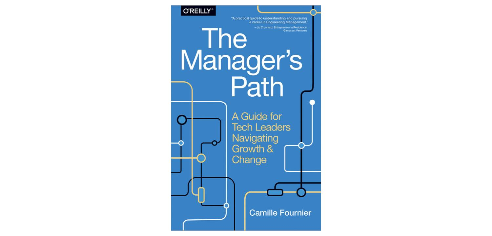
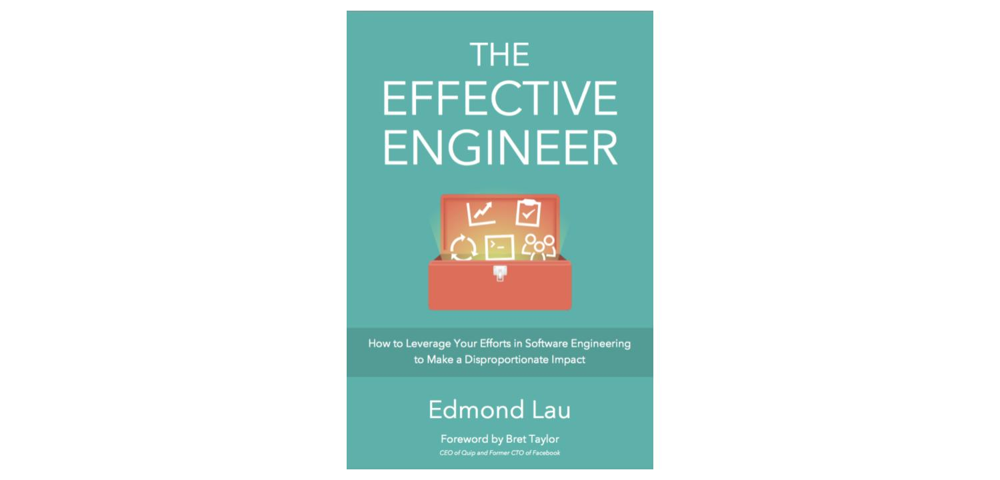
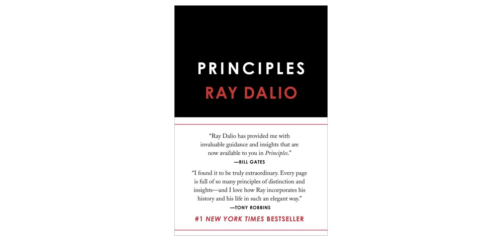
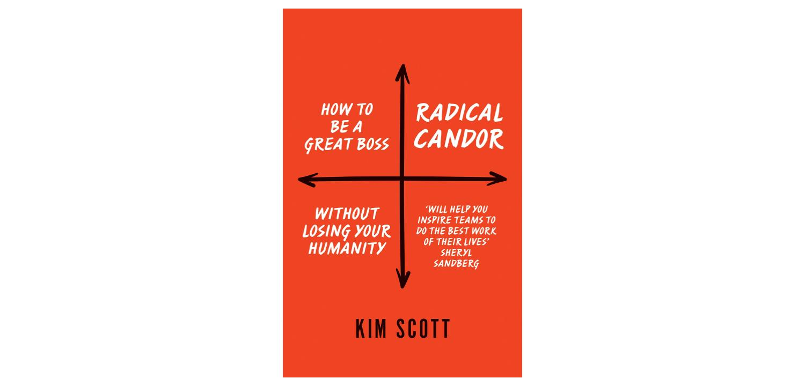

+++
date = "2018-08-05T13:00:00-08:00"
draft = false
title = "My Five Favorite Books for Engineering Leaders"
slug = "five-favorite-books-for-engineering-leaders"
disqus_url = "http://blog.benjamin-encz.de/post/five-favorite-books-for-engineering-leaders"
+++

I recently got asked a lot about book recommendations for engineering leaders. Here are the five books that I've found most helpful so far.

<!--more-->

------

## 1. The Manager's Path

**Author:** Camille Fournier (former CTO of Rent a Runway)

**Focus:** Different engineering leadership roles and their requirements and expectations

This is a very dense, well-structured and pragmatic book that discusses all engineering leadership roles: from tech lead to CTO/VPE. 

I personally also align well with Camille's recommended style of leadership. Unlike many other books I've read she doesn't reduce the management role to a pure people-tending one. Instead she discusses the importance of technology and business strategy, remaining involved in technical decisions, etc. The book provides a ton of tactical tips and interesting anecdotes from Camille's experience for the different roles along the leadership ladder.

## 2. The Effective Engineer

**Author:** Edmond Lau (Engineering Leader at Google, Ooyala, Quora, and Quip)

**Focus:** Making engineering teams create more value with the time they invest

While this book is primarily written for individual contributors I think it is super valuable for engineering managers as well. I have gotten a copy of this book for every new hire on my team. This book focuses on how to become more effective as an engineer. A key insight is that unfortunately a lot of engineering work is low impact and therefore wasted. The book shares ideas on how that waste can be reduced. The book also touches on improving the effectiveness of the entire engineering organization through improving hiring and best practices.

This book is very dense, well-structured and full of practical advice that would take years to learn on the job.

## 3. Principles

**Author:** Ray Dalio (Former CEO of Bridgewater)

**Focus:** Culture and general management through a system thinking lens

A must-read on defining an effective company culture and managing through a system thinking lens.

Ray Dalio was able to create a very specific and highly effective culture at Bridgewater (a hedge fund). Dalio is a strong believer in an "idea meritocracy" where the best ideas win and any ideas should be challenged openly and directly. A key enabler for an "idea meritocracy" is the idea of "radical transparency" - whatever can be shared internally should be shared in order to give everyone the best information to make decisions. Both of these principles lead to a learning organization that continuously improves itself and its members.

Whether or not you agree with all the principles Dalio has, he has done a remarkable job at formulating them clearly and living them within his organization. He also has a very analytical "systems view" of how companies operate and he reveals many management best practices throughout his principles.

## 4. Radical Candor

**Author:** Kim Scott (Senior Leadership Roles at Google & Apple)

**Focus:** People leadership through open feedback and trust

I read this book right after it was released - later it also became part of a book club at PlanGrid. Radical Candor focuses on how a leader can cultivate a culture of open & honest feedback and shows the huge impact such a culture can have on your direct reports and teams.

In general this book is a good summary of modern leadership best practices, with a focus on the people management aspects. It's filled with interesting anecdotes from Kim's vast experience in leadership roles.

## 5. Powerful: Building a Culture of Freedom and Responsibility

**Author:** Patty McCord (former Chief Talent Officer at Netflix)

**Focus:** Creating a high performance culture

After finishing the first draft of this post I had "High Output Management", a management classic by Andy Grove, Intel's former CEO, on this list. That I decided to replace it with "Powerful" is probably both a sign of my personally preferred management style and the fact that best management practices have changed quite a bit from 1983, when Andy's book was published. I honestly think both are worth a read, but if I have to pick between a book focused on management techniques and a book focused on creating a high performance culture, I'm going with the latter.

This short and easy to read book describes Netflix's unconventional culture in more detail. While you certainly don't want to copy another organizations culture directly, many of the ideas outlined in the book should likely be adopted by more organizations. Not unsimilar to the culture Dalio created at Bridgewater, Netflix favors open debate of ideas and radical transparency. They also have a strong focus on freedom and responsibility. Patty does a great job of demonstrating, with examples, which positive impact Netflix's culture had on their organization.